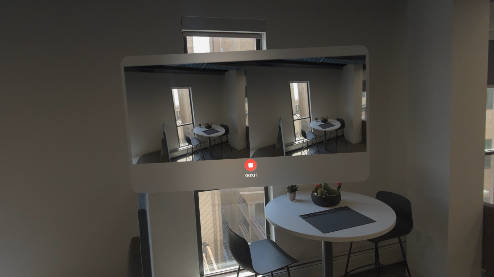

# Vision Pro Stereo Video Capture



*By Griffin Hurt \<griffhurt@pitt.edu\> with resources from the [Surreality Lab](https://surreality.pitt.edu)*

### Overview
This project provides an easy way to capture rectified stereo videos with intrinsic and extrinsic camera data using the Apple Vision Pro. While the Vision Pro supports stereo video capture via [spatial video](https://support.apple.com/guide/apple-vision-pro/capture-dev7068c3c93/visionos), camera parameters are not saved, which makes projection into a point cloud difficult. This application exports camera parameters as a `.json` file to make reconstruction more straightforward (assuming a high-fidelity stereo matching pipeline is available).


### Usage

1. Make sure you have the newest Xcode 26 beta installed on your Mac and the visionOS 26 beta installed on your Vision Pro.
2. Replace the `Enterprise.license` dummy file with your license.
3. Build the application and run it on the Apple Vision Pro.
4. Start the camera preview using the button at the bottom of the screen (*this starts the immersive space, which is necessary for main camera access*)
5. Start capturing video using the red button
6. End your capture by pressing the same button (now with a stop icon)
7. Captures will be saved to the application's folder in the "Files" application. Video files are saved with side-by-side format in the "Video Captures" folder and data files are stored in JSON in the "Video Data" folder.

### Example Camera Data File
Below is an example of the format for video data files:
```json
{
    "right_extrinsics": {
        "m00": 1.0000001,
        "m01": -4.034555e-10,
        ...
        "m33": 1,
    },
    "left_intrinsics": {
        "m00": 496.95917,
        ...
        "m22": 1
    },
    "right_intrinsics": {
        ...
    },
    "left_extrinsics": {
        ...
    }
}
```

The Vision Pro cameras are displaced in the $x$ coordinate, so baseline can be extracted by computing `abs(data["left_extrinsics"]["m03"] - data["right_extrinsics"]["m03"])`. Those seeking a more robust solution may choose to find the distance between the translation vectors of the cameras (4th column vector in the extrinsics).

Point cloud coordinates can be computed by the following equation:
$$
\mathbf{P}_{\text{camera}} = 
\begin{bmatrix}
    X \\ Y \\ Z
\end{bmatrix}
= \frac{f_x \cdot \left\| \mathbf{t}_L - \mathbf{t}_R \right\|}{d} \cdot
\begin{bmatrix}
    \frac{u - c_x}{f_x} \\
    \frac{v - c_y}{f_y} \\
    1
\end{bmatrix}
$$
Where:
$$
E_L = \text{extrinsics matrix for the left camera} \\
E_R = \text{extrinsics matrix for the right camera} \\
\mathbf{t}_L = E_L[:, 4]\\
\mathbf{t}_R = E_R[:, 4]\\
u = \text{x pixel coordinate} \\
v = \text{y pixel coordinate} \\
K = \text{intrinsics matrix for the camera} \\
f_x = K_{1,1}\\
f_y = K_{2,2} \\
c_x = K_{1,3} \\
c_y = K_{2,3} \\
d = \text{disparity (horizontal displacement of the pixel)}
$$

### Advice on Stereo Matching

We have been able to create the most accurate point clouds from Vision Pro captures using the [FoundationStereo model](https://nvlabs.github.io/FoundationStereo/) from NVIDIA. Using an inference batch size of 4, frames take ~1 second to process on an RTX A5000. Whenever the script to generate point clouds from these captures is cleaner, I can add it to the repository.